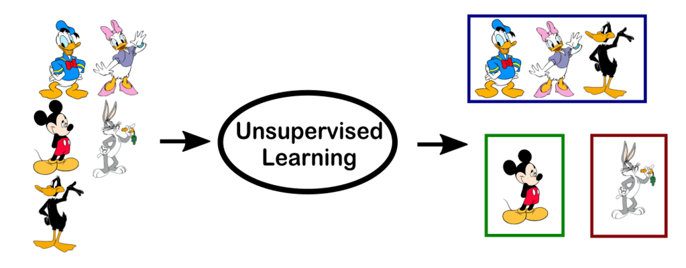

Ensemble methods are very popular in the domain of machine learning. We all must have seen kagglers creating ensembles to boost their score, be it classification or regression tasks. BUT, these are supervised tasks. We rarely hear, or many of us would have heard of someone applying ensemble methods to clustering (unsupervised learning). The following notebook discusses and demonstrates one of the ensemble methods (similarity matrix) for clustering (k-means).
